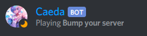
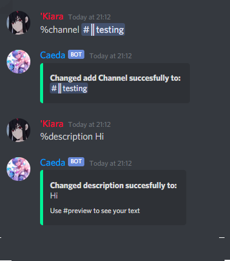
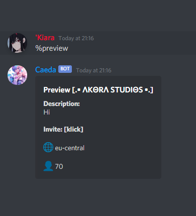

# Bump-Bot
**Discord.js Server Bump Bot NOT SUPPORTED!!!!!!!!!!**

[](https://discord.gg/ufEjGrbYWw)

# ⚙️ Setup
## 🔧 Configuration
> **[index.js  line 20](https://github.com/DragonCat4012/Bump-Bot/blob/main/index.js#L20)**
> ```JS
> const supportGuildId = ''
> const supportGuildLogChannelId = ''
> const Bottoken = ''
> const ownerID = ''
> ```

## 🤖 Example Setup
> ```JS
> const supportGuildId = '1038267876622221332'
> const supportGuildLogChannelId = '1216835952870428793'
> const Bottoken = 'Your Bot Token'
> const ownerID = "696282645100888086"
> ```

## 🌿 Run
```node index.js```
(remember to install all needed dependecies ;3 Use ```npm i``` to install them )

# 🔧 Commands
|  Name         | Beschreibung                              |
| ------------- | ----------------------------------------- |
| bump          | Bumps your Server                         |
| channel       | Change your server advertisment channel   |
| color         | Change your bump embed color              |
| description   | Change your server description            |
| goodbye       | Change your server goodbye channel        |
| help          | Shows you all my Commands                 |
| invite        | Get my Invite link :3                     |
| prefix        | Change your server prefix                 |
| preview       | Shows your server bump embed              |
| welcome       | Change your server welcome channel        |
| status        | 'Change the bots status        |

## 🍂 Dependencies
* [discord.js](https://www.npmjs.com/package/discord.js)
* [parse-ms](https://www.npmjs.com/package/parse-ms)
* [sequelize](https://www.npmjs.com/package/sequelize)
* [sqlite3](https://www.npmjs.com/package/sqlite3)


## ☘️ Example


```
Logging in...                            index.js:98
 > 🗸 Server Cache                        database/dbInit.js:50
 > 🗸 Cached Database Entries             index.js:71
 >  Logged in as: Tenshi#3639            index.js:118
.• GSv2.0 •.   >>>  bumped!
```

# 📸 Showcase
Note: the default prefix is %. You can change this in the [dbInit File](https://github.com/DragonCat4012/Bump-Bot/blob/main/database/dbInit.js)
| Bump | Setup | Preview|
| - | - | -|
||||
